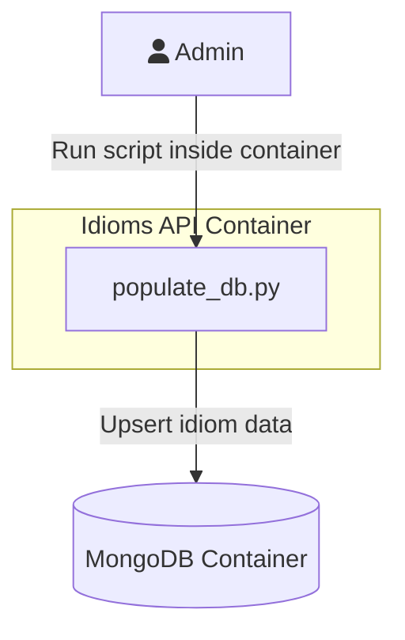
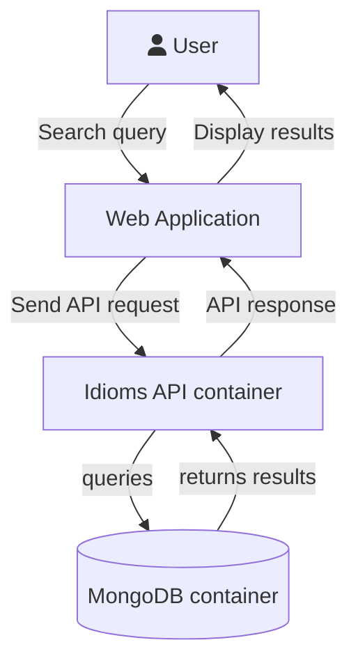
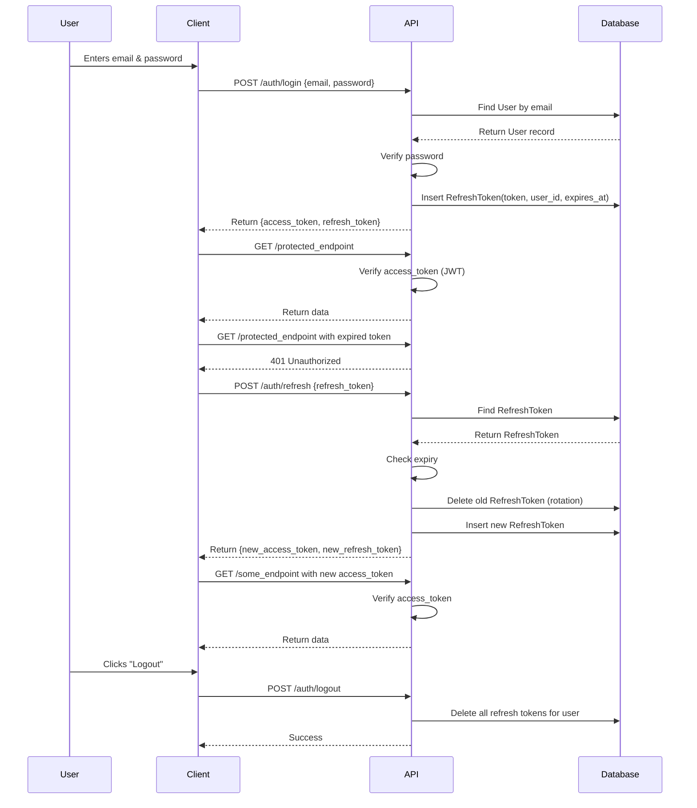

# Idiom Search API

A RESTful set of endpoints to query idioms and their definitions. The English language has a rich tradition of expressions. It can be challenging for native or newer English speakers to understand some idioms. This API is here to demystify some of them and easily find the right phrase when you need it.

## Use Cases

Here are some high-level use cases for this project. As a multi-container setup, these diagrams will explain how a user interacts with them.

### API Requests

This is the most common use case. A user who has successfully authenticated makes RESTful requests using the Idioms API. It provides a controlled interface to the database.


### Updating Database Contents

The Idioms API only permits read requests to the database contents. In order to update the database, an admin user must use the `populate_db.py` utility. They can run this script once inside the Idioms API container with a Bash shell.



### Website Interface

A logical future use case would be to connect a web application GUI to this API. Such a web application would live in a separate Docker container from the API. A user would need to authenticate to ensure they can access the needed features. After this, they can make search requests using the Idioms API.



## Dependencies

* Linux operating system or Docker Desktop
* Docker 29 or higher
* Docker Compose v5.0.0 or higher

## Database Configuration

Create a file called `.env-mongo-access` in the root of this repository. Copy the following contents and paste them into this file. This is required to read and write to the MongoDB database instance.

```ini
MONGO_APP_USER=<username chosen for your database>
MONGO_APP_PASSWORD=<password chosen for your database>
MONGO_APP_DB=idioms_core
MONGO_HOST_PORT=27017

JWT_SECRET_KEY=jfoiewjfoiewnfiolewnfoliewneiofnewiofnoweinefio
```

When you need to access a command line terminal for the MongoDB container, use the `mongosh` utility. Here is an example for how to connect to the database using the environment variables injected into the container by the .env file.

```bash
mongosh --username $MONGO_APP_USER --password $MONGO_APP_PASSWORD --authenticationDatabase $MONGO_APP_DB
```

## Installation (Local Development)

This API is a group of Docker containers that are connected via Docker networking. For local development, use standard docker compose commands. Run the following commands from the root of this repository to build and deploy a local instance of all containers for this API:

```bash
docker compose build
docker compose up -d
```

The API will be accessible on port 8080 of your local machine like this: http://127.0.0.1:8080. You can target RESTful requests at this URL with any HTTP client you choose.

## Updating Idioms Database Contents

Currently the API provides read-only access to the database. The `populate_db.py` script is the primary way to insert and update idiom content into the MongoDB database. It follows an "upsert" pattern, meaning that it will insert an idiom that does not exist in the database. If an idiom record does exist, it will update the other fields based on the provided input file.

Provide an input file named `idioms-master-list.tsv` in the same directory as the `populate_db.py` script. It should be a tab-separated value file that looks like this:

```
Idiom	Definition	Synonyms
A bad break	1. A misfortune. 2. A serious bone fracture.	reversal, setback, stumbling block, trouble
A bad hair day	A day on which everything seems to go wrong.	series of unfortunate events, being grouchy, irritable
```

*Note*: The Synonyms column contains a comma-delimited string for each entry.

Follow these steps in order to update the contents of your database instance:
1. Provide an input file named `idioms-master-list.tsv` in the same directory as the `populate_db.py` script.
1. Run `docker compose build && docker compose up -d` to start your instance of the Idioms API containers.
1. Run a docker exec command to start a Bash terminal inside of the idiom-search-app container: `docker exec -it idiom-search-app-1 bash`
1. Change the working directory: `cd /code/api`
1. Run the `populate_db.py` script.

## API Documentation

FastAPI provides Swagger and Redoc out of the box. This provides automatically generated API documentation and a web-based client to understand the provided endpoints, their expected inputs, and more.

* Swagger: http://127.0.0.1:8080/docs#/  
* Redoc: http://127.0.0.1:8080/redoc

## Project Roadmap

There is more work planned for this project. Here are some ideas for where to steer future development.

* Build a front-end web interface to access idiom data (separate container)
* Add endpoints for to analyze text for idiom recommendations

## Authentication Flow

Here is a diagram that illustrates the authentication flow for logging in with an existing user and requesting a new refresh token:


